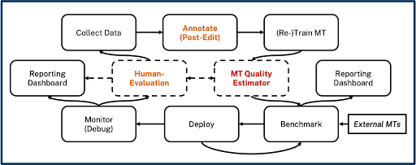

# Efficient Machine Translation Corpus Generation with LLM Integration
## Introduction
This README outlines a groundbreaking approach to Machine Translation (MT) corpus generation, developed and implemented by aiXplain Inc. This method leverages Large Language Models (LLMs) to enhance the quality and efficiency of MT corpora, addressing the inherent challenges in traditional corpus generation methods.

<!-- add a image from imgs/workflow.png with wicth covers page -->


## Abstract
This project presents an innovative approach to machine translation (MT) corpus generation, blending human-in-the-loop post-editing with the utilization of Large Language Models (LLMs). This methodology enhances both the efficiency and quality of MT processes. We've built on our previous work, which focused on real-time training of custom MT quality estimation metrics informed by linguist updates, and expanded it to include the capabilities of LLMs. This integration leads to a more efficient and accurate translation process, including features like LLM-Enhanced Translation Synthesis, LLM-Assisted Annotation Analysis, LLM-Driven Pseudo Labeling, and LLM Translation Recommendation System. The source code and a demo video of this project are available for community use.

Source Code: [GitHub Repository](https://github.com/aixplain/Efficient-MT)
Demo Video: [YouTube Link](https://www.youtube.com/watch?v=vkDH9fC7HfU)


## How to run?

```bash
docker-compose up -d
uvicorn main:app --port 8088

```
* Admin app
```bash
python -m streamlit run  /home/ubuntu/repos/Efficient-MT/web_app/admin/admin_app.py
```

* Rater app
```bash
python -m streamlit run  /home/ubuntu/repos/Efficient-MT/web_app/annotator/rater_app.py
```
